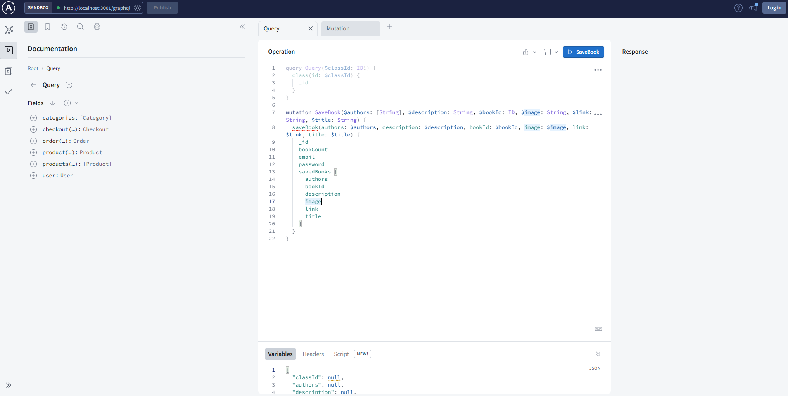
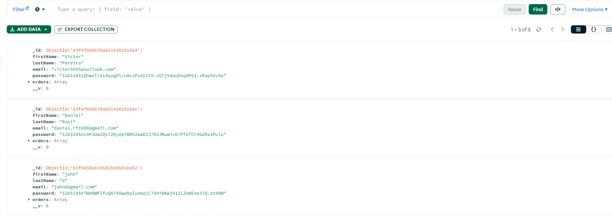
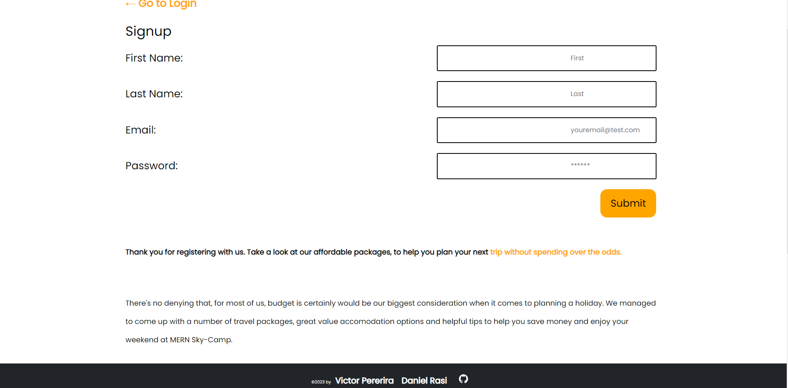
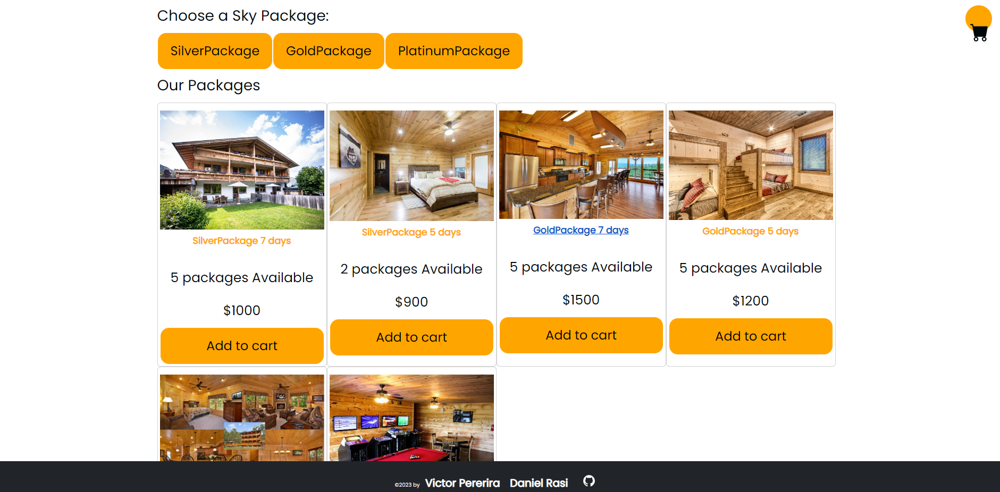
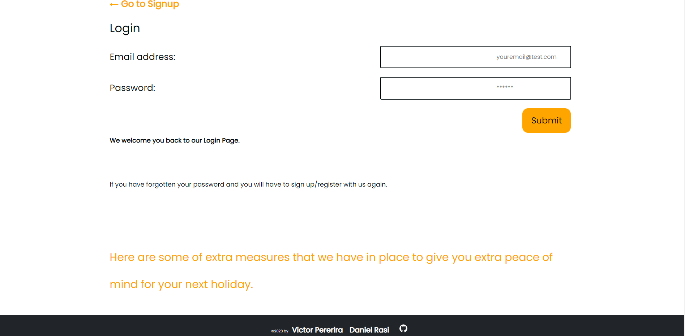
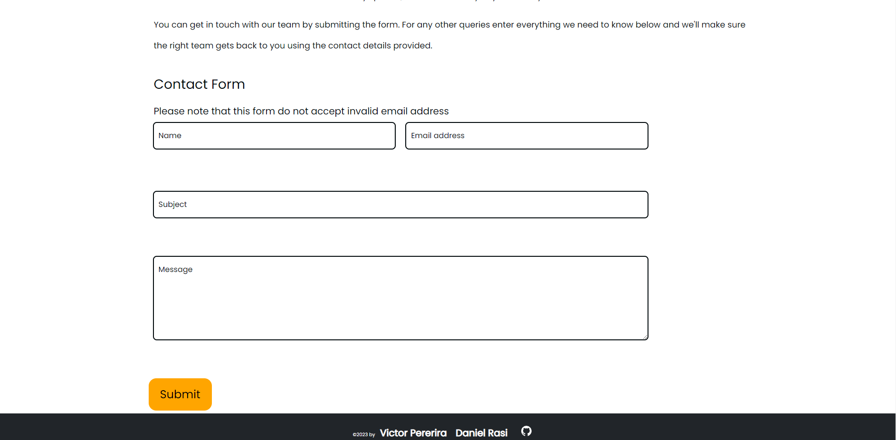

# MERN-Sky-Camp

[Deployed Application](https://mighty-forest-97657.herokuapp.com/)

## Table of Contents
*[Description of Repository](#Repository-Description)

*[User-Story](#User-Story)

*[Contribution-Guidelines](#Contribution-Guidelines)

*[Repositiory-End-Goal-Criterea](#Repositiory-End-Goal-Criterea)

*[License](#License)

*[Contact](#Contact)
    
 # Repository-Description
###### [Back to Table of Contents](#Table-of-Contents)
This project is to build an application encouraging the users to stay active, enjoy the fresh air and sunshine found on the top of the mountain. Camping is an excellent way to burn a ton of calories while doing some great activites and feeling healthier. The application will be created as a MERN stack single-page application in which the users will be able to browse through the different Camping packages and add the package or remove the package before checkout. Stripe payment platform will be used for the users to pay for the package. Contact Form will be used for the users to contact MERN Sky Camp Team in case of cancellation due to unforeseen circumstances or other enquiries.

    
## User-Story
### As the Developer
###### [Back to Table of Contents](#Table-of-Contents)
our group will use everything We’ve learned throughout this course to create a MERN stack single-page application that works with real-world data to solve a real-world challenge, with a focus on data and user demand. This project will provide you with the best opportunity to demonstrate our problem-solving skills, which employers will want to see during interviews. Once again, the user story and acceptance criteria will depend on the project that you create, but your project must fulfill the following requirements:

Use React for the front end.

Use GraphQL with a Node.js and Express.js server.

Use MongoDB and the Mongoose ODM for the database.

Use queries and mutations for retrieving, adding, updating, and deleting data.

Be deployed using Heroku (with data).

Have a polished UI.

Be responsive.

Be interactive (i.e., accept and respond to user input).

Include authentication (JWT).

Protect sensitive API key information on the server.

Have a clean repository that meets quality coding standards (file structure, naming conventions, best practices for class and id naming conventions, indentation, high-quality comments, etc.).

Have a high-quality README (with unique name, description, technologies used, screenshot, and link to deployed application).

## Contribution-Guidelines
###### [Back to Table of Contents](#Table-of-Contents)
Victor Pereira
Daniel Rasi
Jared Williams

## Installation
###### [Back to Table of Contents](#Table-of-Contents)
The MERN stack has a three-layer architecture based on Model-View-Controller pattern and each interconnected layer performs a specific function in the application and this application is a MERN stack application which is a group of four technologies:-

React JS for the front end, that is, the client (View) in which the user inputs data and the data display,
GraphQL with a Node.js and Express.js server for the method called to store and retrieve data,
MongoDB and Mongoose ODM for the database (Model) to store raw data and contains no logic.

Before deploying to Heroku, the application is run in develop mode and tested using GraphQL by entering at command prompt:-

npm run seed

npm run develop ( cd to the correct directory)

As a start and at the command prompt, type in npm install to ensure all that the dependencies are installed.

Before deploying to Heroku, the application is run in develop mode and tested using GraphQL by entering at command prompt:-

npm run seed

npm run develop ( cd to the correct directory)

## Overview: What Was Accomplished!
### Workflow [Back to Table of Contents](#Table-of-Contents)
We have deployed a succesful  MERN app

### Screenshots (Building this application)
###### [Back to Table of Contents](#Table-of-Contents)
An example of the testing using GraphQL playground at http://localhost:3001/graphql

This application has been deployed to Heroku with MongoDB database using MongoDB Atlas and below is an example of MongoDB database using MongoDB Atlas

    

## Repositiory-End-Goal-Criterea
###### [Back to Table of Contents](#Table-of-Contents)
We would like to have the Stripe payment working correctly and Service worker to function offline.
    
## License
MIT
* For more information on license types, please reference this website
for additional licensing information - [https: //choosealicense.com/](https://choosealicense.com/).

    
## Contact
* Github Username: DannybOoOy
* Github Profile link:(https://github.com/Dannyb0o0y/MERN-Sky-Camp)
* Email: victor5055@outlook.com
         Jaredwilliams1019@gmail.com
         danial.rf1999@gmail.com

Permission is hereby granted, free of charge, to any person obtaining a copy of this software and associated documentation files (the "Software"), to deal in the Software without restriction, including without limitation the rights to use, copy, modify, merge, publish, distribute, sublicense, and/or sell copies of the Software, and to permit persons to whom the Software is furnished to do so, subject to the following conditions:

The above copyright notice and this permission notice shall be included in all copies or substantial portions of the Software.

THE SOFTWARE IS PROVIDED "AS IS", WITHOUT WARRANTY OF ANY KIND, EXPRESS OR IMPLIED, INCLUDING BUT NOT LIMITED TO THE WARRANTIES OF MERCHANTABILITY, FITNESS FOR A PARTICULAR PURPOSE AND NONINFRINGEMENT. IN NO EVENT SHALL THE AUTHORS OR COPYRIGHT HOLDERS BE LIABLE FOR ANY CLAIM, DAMAGES OR OTHER LIABILITY, WHETHER IN AN ACTION OF CONTRACT, TORT OR OTHERWISE, ARISING FROM, OUT OF OR IN CONNECTION WITH THE SOFTWARE OR THE USE OR OTHER DEALINGS IN THE SOFTWARE.
